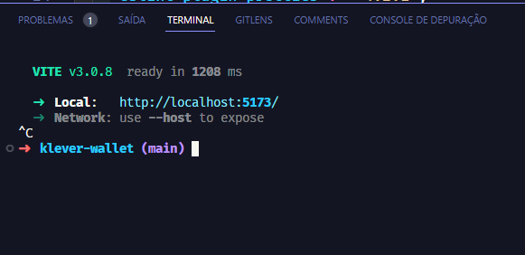
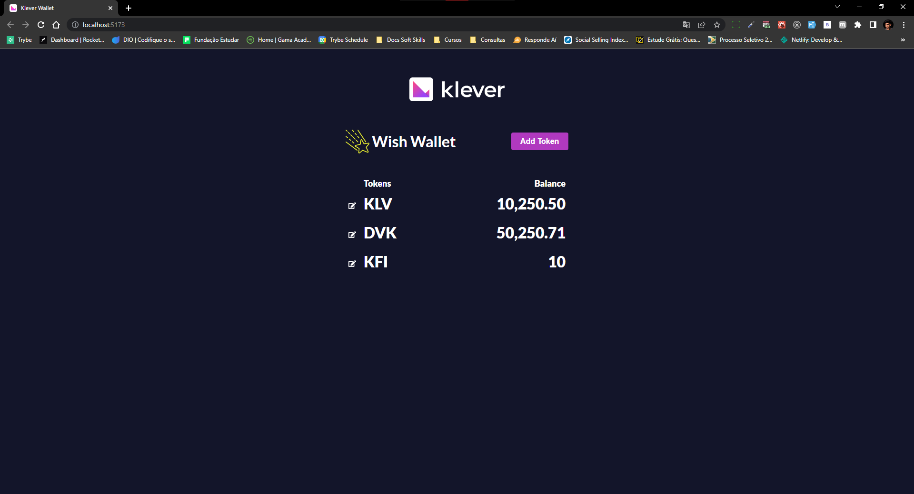

# Klever Wallet

## 👨🏽‍💻 Desenvolvedor

**Caleb Lima**

Linkedin: [https://www.linkedin.com/in/caleb-lima/](https://www.linkedin.com/in/caleb-lima/)

Github: [https://github.com/jovemcleb](https://github.com/jovemcleb)

Email: lima.carodoso.caleb@gmail.com

Celular: 91 980119059

## \***\*📝\*\*** Descrição

Este projeto consiste em uma simples carteira, onde é possível:

- Adicionar um token de criptomoeda e o seu saldo;
- Exibir tokens cadastrados;
- Editar token e saldo;
- Excluir token da carteira.

## \***\*🔧 Tecnologias utilizadas\*\***

- React JS
- SASS
- React Icons
- EsLint

## \***\*🚀 Rodando o projeto\*\***

1. Primeiramente, clone o projeto com o seguinte comando:

```bash
git clone git@github.com:tatialveso/readme-template.git
```

2. Em seguida, entre no diretório e instale as dependências do projeto com:

```bash
npm install
OU
yarn install
```

3. Para executar o projeto digite o comando:

```bash
npm start
OU
yarn start
```

4. O seu terminal irá retorna algo similar a imagem abaixo, basta segurar o Ctrl do seu teclado e clicar em cima de `http://localhost:5173`



5. Agora é só aproveitar o projeto:


